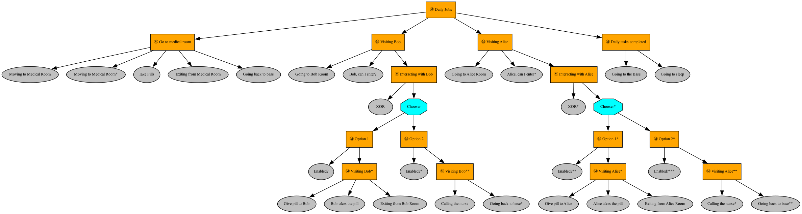

## Installation
On Windows:

```
pip install -r requirements_windows.txt
```

On MacOS

```
pip install -r requirements_macos.txt
```

## Launching

To launch the software and ensure UTF-8 encoding is used for both input and output, you can run the following command:

```bash
python -X utf8 game.py
```

## Generate configuration.py

`configuration.py` is auto-generated with generateDS: https://github.com/ricksladkey/generateDS .

To re-generate `configuration.py` after a change of `schema_configuration.xsd`:

```bash
python $PATH$/generateDS.py -o configuration.py configuration/schema_configuration.xsd
```

## ToDo List

- [x] Implement a basic simulator of the scenario
- [x] Implement robot daily job using behavioural trees
- [x] Implement User-Robot interaction throught keyboard
- [x] Implement PathPlanner, Verificator and Conditioner
- [x] Load user from XML
- [x] Automatically generate map from XML
- [ ] Configure robot daily plan according patients XML (use patientConfiguration attribute)

## Exam Solution
This software simulate in a 3D environment three human profiles (Bob, Alice and Nurse) and a robot that interacts with these characters and move inside the clinic. 
In particular we implemented the following profiles for Bob and Alice.
- Bob profile: If I will refuse the medications or to take pills, it is fine that the robot insists a few times. However, after a few attempts it should call the nurse. I accept that the robot uses cameras and microphones, however all my data cannot be distributed to third parties. Moreover, the robot can only store and/or distribute to the nurse videos and audios that are strictly necessary for my health, and in any case videos cannot be recorded in the toilet.
- Alice profile: I accept having assistive robots checking my health status and supporting me, however, when I show signals of distress, the robot should put me in contact with my daughter by making a video call; if she does not answer the robot should ask the intervention of a nurse and leave my room if I will be in my room of move away from me.

In order to simulate human emotions we simply press a specific key on the keyboard.

### Robot daily job
The image below summarize all the tasks that the robot will daily execute in a behavioural tree.


## Useful links:
- [Ursina](https://www.ursinaengine.org/)
- [Robotics Toolbox Python](https://petercorke.github.io/robotics-toolbox-python)
- [Bug2 Planner](https://automaticaddison.com/the-bug2-algorithm-for-robot-motion-planning/)
- [Distance transform: Base](https://robotics102.github.io/lectures/rob102_07_distance_transform.pdf)
- [Distance transform: Potential fields](https://robotics102.github.io/lectures/rob102_08_potential_field.pdf)
- [Behavioural Tree](https://roboticseabass.com/2021/05/08/introduction-to-behavior-trees/)