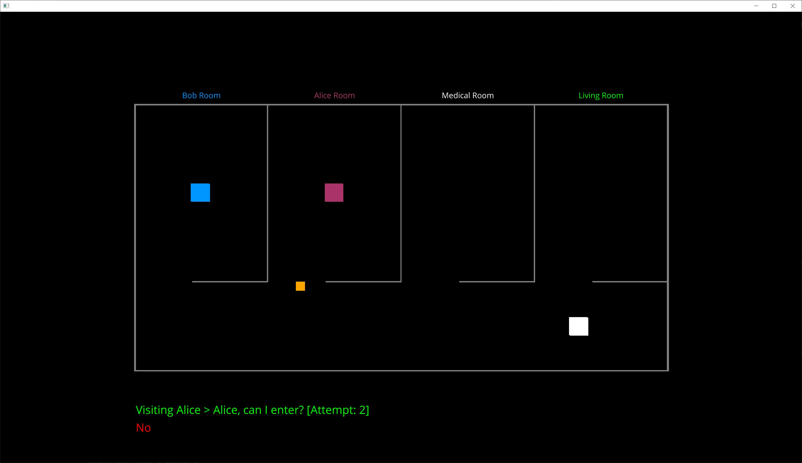
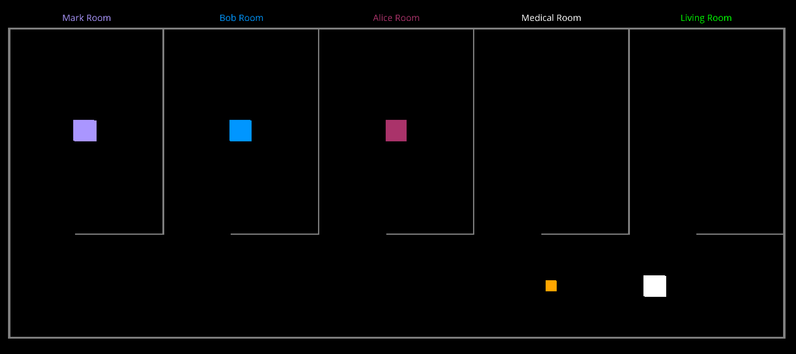
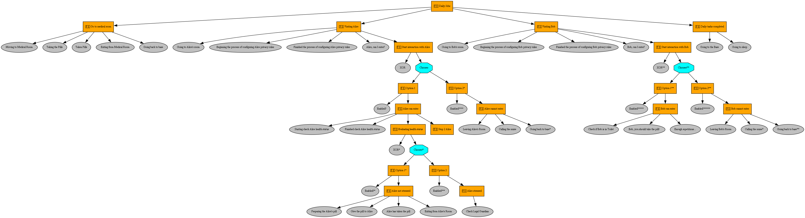

# Introduction



The software presents a cutting-edge implementation of a highly customizable model, designed specifically to address and explore the intricate aspects associated with automation and ethical considerations within the realm of computer science. By leveraging its sophisticated framework, this software enables in-depth analysis and management of the complex interplay between automated systems and ethical dimensions.

To ensure the utmost integrity and reliability, the software offers two meticulously crafted XSD schemas that serve as robust tools for validating the intricate configurations of both the robot and the individual patient. These schemas act as invaluable resources, ensuring that the specified parameters adhere to predefined standards, thus guaranteeing a coherent and compliant setup.

Significantly, this software can be envisaged as the foundational architectural prototype, establishing a solid groundwork upon which further advancements, configurations, and refinements can be built. By providing a flexible and adaptable framework, it allows for seamless evolution and intricacy within the proposed scenario, accommodating diverse requirements and fostering innovation in the field.

With its capabilities, the model holds immense potential for facilitating comprehensive simulations and meticulous verification of the robot's programming. This empowers researchers and practitioners to scrutinize and fine-tune the intricacies of the robot's behavior, meticulously aligning it with ethical, privacy, and patient dignity principles. By striving to ensure that these essential values are upheld, the software actively contributes to creating a responsible and humane technological ecosystem.

The environment is fully configurable via XML files. For example you can add a new patient with the following steps:
- create the patient XML under configurations/patients
- add the patient's room inside configurations/robots/robot.xml
- check that the room ID is the same in both patient and robot XMLs


# Authors

* Andrea de Ruvo, <andrea.deruvo@gssi.it>
* Alberto Petrucci, <alberto.petrucci@gssi.it>

# Professors

* Martina De Sanctis, <martina.desanctis@gssi.it>
* Paola Inverardi, <paola.inverardi@gssi.it>
* Ludovico Iovino, <ludovico.iovino@gssi.it>
* Patrizio Pelliccione, <patrizio.pelliccione@gssi.it>

# Installation
For all the test we used a virtual environment with all the packages listed in requirements_*.txt. 
Furthermore we used Python 3.10.8.

For Windows:

```
pip install -r requirements_windows.txt
```

For MacOS

```
pip install -r requirements_macos.txt
```

# Launching

To launch the software and ensure UTF-8 encoding is used for both input and output, you can run the following command:

```bash
python -X utf8 game.py
```

# Update generated entities

The `patient.py`, `robot.py` and `hospital.py` files in the `generated` folder are auto-generated using generateDS. To re-generate them after making changes to schema_configuration.xsd, use the following commands:

```bash
python $PATH$/generateDS.py -o generated/robot.py schemas/robot.xsd
```

```bash
python $PATH$/generateDS.py -o generated/patient.py schemas/patient.xsd
```

# Technicalities
The software is written in Python 3 and utilizes the following libraries:

* PyTrees: PyTrees is a versatile Python library for working with tree-based data structures. It provides a comprehensive set of functionalities for creating, managing, and analyzing hierarchical data representations. With support for tree traversal algorithms and customizable behaviors, PyTrees offers efficient solutions for tree-related tasks.

* Ursina: Ursina is a lightweight game development framework for Python. It simplifies the process of creating interactive 2D and 3D applications by providing a user-friendly API and a range of built-in components. With its intuitive design and extensive documentation, Ursina enables developers to quickly prototype and develop immersive graphical experiences.

* Robotics Toolbox Python: The Robotics Toolbox Python is a library designed for robotic applications and research. It offers a wide range of tools and algorithms for robot kinematics, dynamics, control, and visualization. With its comprehensive collection of functions, the Robotics Toolbox Python facilitates the development and analysis of robotic systems in various domains.

* generateDS: generateDS is a Python library that simplifies the process of generating Python data structures (classes) from XML and XSD (XML Schema Definition) files. It automatically generates Python classes that correspond to the defined elements and attributes in the XML and XSD schemas. This library streamlines the integration of XML data into Python programs, making it easier to process and manipulate structured data.

By leveraging these libraries, the software benefits from enhanced capabilities in managing tree-based data structures, creating interactive graphical interfaces, implementing advanced robotics functionalities, and seamlessly integrating XML data processing into Python applications.

# Exam Solution
This software simulate in a 3D environment three human profiles (Bob, Alice and Nurse) and a robot that interacts with these characters and move inside the clinic. 
In particular we implemented the following profiles for Bob and Alice.
- Bob profile: If I will refuse the medications or to take pills, it is fine that the robot insists a few times. However, after a few attempts it should call the nurse. I accept that the robot uses cameras and microphones, however all my data cannot be distributed to third parties. Moreover, the robot can only store and/or distribute to the nurse videos and audios that are strictly necessary for my health, and in any case videos cannot be recorded in the toilet.
- Alice profile: I accept having assistive robots checking my health status and supporting me, however, when I show signals of distress, the robot should put me in contact with my daughter by making a video call; if she does not answer the robot should ask the intervention of a nurse and leave my room if I will be in my room of move away from me.

In order to simulate human emotions we simply press a specific key on the keyboard.

## Robot daily job
PyTrees is a Python library for working with tree-based data structures. It provides powerful functionalities for creating, manipulating, and analyzing trees. With support for tree traversal algorithms and customizable behaviors, PyTrees enables efficient management of hierarchical data representations.

The image below summarize all the tasks that the robot will daily execute in a behavioural tree implemented in PyTrees.


## User Interactions
Once the software has been launched and its environment started you can interact with it using the following keyboard keys:
 - "**s**": To start the robot daily activities
 - "**r**": To reset the environment
 - "**y**": To simulate patient's affermative answer to robot's question "Can I enter? (inside patient's room)"
 - "**n**": To simulate patient's negative answer to robot's question "Can I enter? (inside patient's room)"

## Actions
We summarized all the action that a robot can accomplish in three main cathegories:
- **MovingAction**: this class implements all the stuff needed to allow a robot movement (inside the world) from a starting point A to a destination point B
- **ExecutionAction**: this class implements all the stuff to execute a logic process
- **InteractionAction**: this class implements all the stuff to to allow a robot to interact with an external entity (in this case a patient)

All the classes implements a callback (*onComplete*) that it is fired every times the action succesfully completes. Their source code can be found under `./planner/actions.py`.

## Planner
The *Planner* is a class able to integrate the possible robot actions inside a scenario based on the behavioural trees. In general it implements two kind of scenarios:
- *static scenario*: it is a sequence of actions that a robot has to execute every time in the same way
- *dynamic scenario*: it is a sequence of actions that change at run time due to external interations

For the first case we simply implemented the correct sequence in the behavioural tree. For the second case, instead, we supposed that any interaction is implemented by a Brownian process that will condition the behavior of the robot.
Its source code can be found under `./planner/planner.py`.

# Enhancements

* At present, we use Bernoullian non-deterministic choices. By incorporating other types of distributions, we could more suitably weigh specific attributes
* Enlarge the scope and detail within the XML files
* Broaden the environment or 'world' within the simulation

# Useful references
- [Ursina](https://www.ursinaengine.org/)
- [Robotics Toolbox Python](https://petercorke.github.io/robotics-toolbox-python)
- [GenerateDS]( https://github.com/ricksladkey/generateDS)
- [Bug2 Planner](https://automaticaddison.com/the-bug2-algorithm-for-robot-motion-planning/)
- [Distance transform: Base](https://robotics102.github.io/lectures/rob102_07_distance_transform.pdf)
- [Distance transform: Potential fields](https://robotics102.github.io/lectures/rob102_08_potential_field.pdf)
- [Behavioural Tree](https://roboticseabass.com/2021/05/08/introduction-to-behavior-trees/)